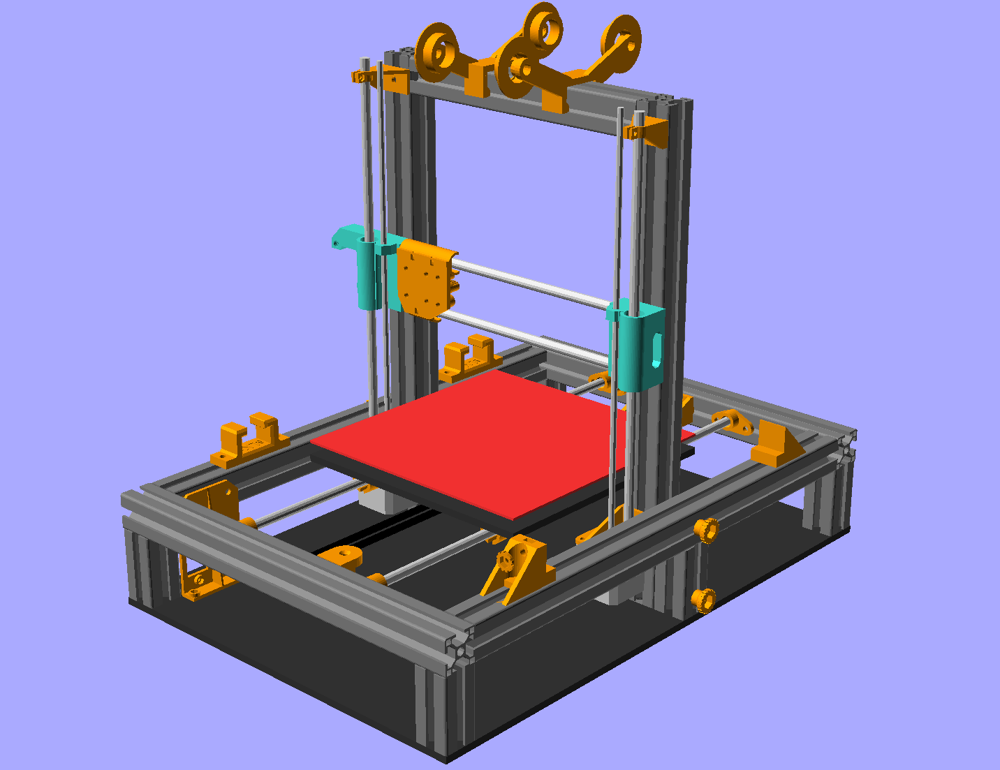

# elka1
DIY folding RepRap

This is a folding 3D printer, based on the Prusa i3 and a custom frame. The main features are:

* Compatible with i3 parts (X axis and extruders)
* Full size 20x20cm bed
* Made of 30x30mm alu profile
* Foldable without any tool
* Autoleveling
* Customizable design made with openscad

